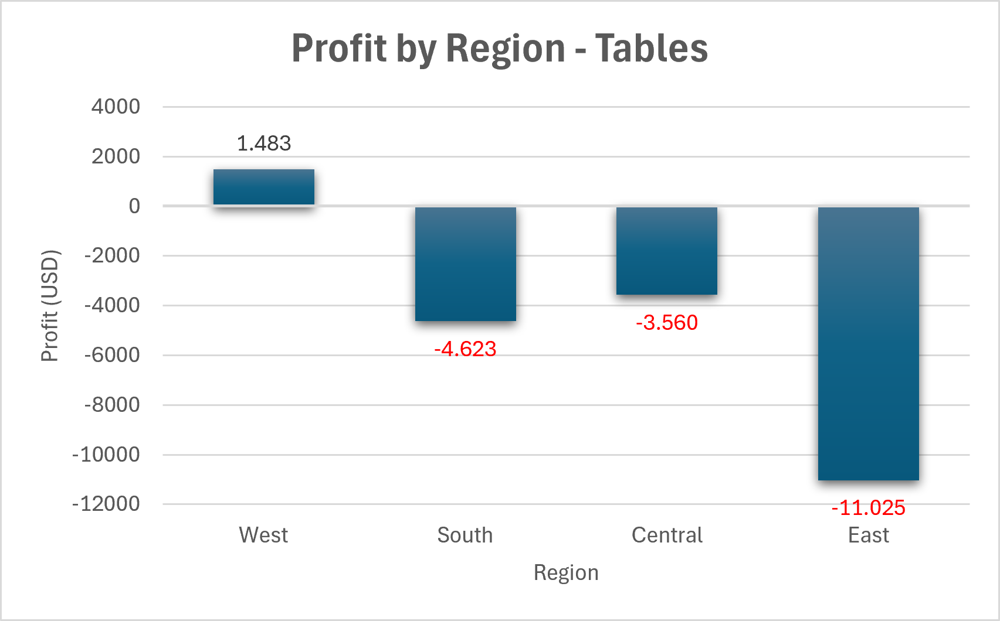
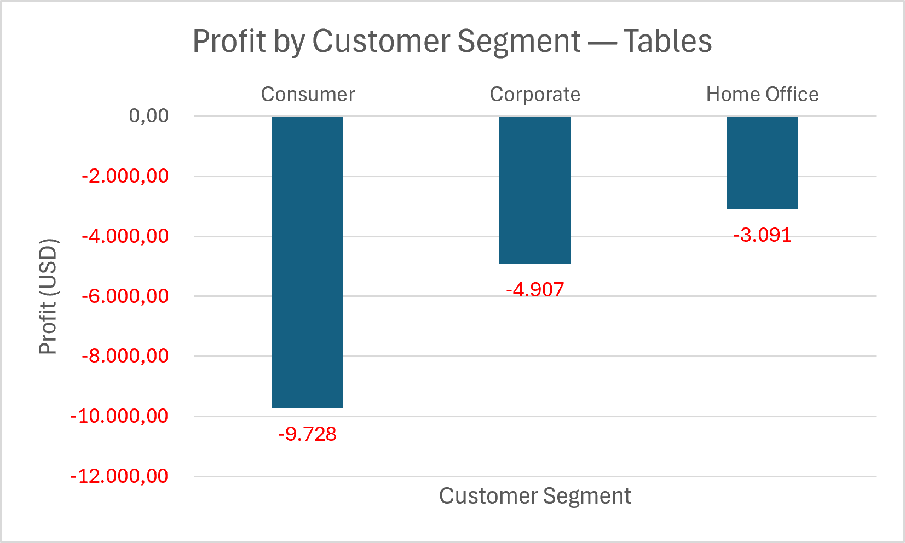

# Sales & Profitability Analysis

## Project Goal
This project analyses sales, costs and profitability data to identify
revenue drivers, high-margin products and potential profitability risks.

## Business Questions
- Which products and categories generate the highest revenue?
- Which products generate the highest profit margin?
- How do revenue and profit develop over time?
- Which areas require management attention?

## Planned Tools
- SQL
- Python
- Power BI
- Excel

## Project Status
In progress. The project currently includes data preparation,
category-level profitability analysis and a discount analysis for
the Tables sub-category.

Next steps:
- Extend the analysis to additional product categories.
- Build a reproducible SQL analysis workflow.
- Create an interactive Power BI dashboard.

## Author
Brian Jacob Nergiz

## Discount Analysis: Tables

Tables were profitable without discounts, but became unprofitable from a
20% discount onward. The largest losses occurred at discount levels between
40% and 50%.

**Key finding:** Discounts of 20% or more make the Tables sub-category unprofitable.

## Regional Profitability Analysis: Tables

The regional analysis shows that the Tables sub-category is only slightly profitable in the West region, while the South, Central and East regions generate losses.

**Key finding:** East has the largest absolute loss (-11,025) and the weakest profit margin (-28.17%), based on the regional profitability calculation.

## Customer Segment Profitability Analysis: Tables

The customer segment analysis shows that the Tables sub-category generates losses across all customer segments.

**Key finding:** Consumer generates the highest sales volume but also the largest absolute loss (-9,728). Corporate has the least negative profit margin (-6.92%), but remains unprofitable.
