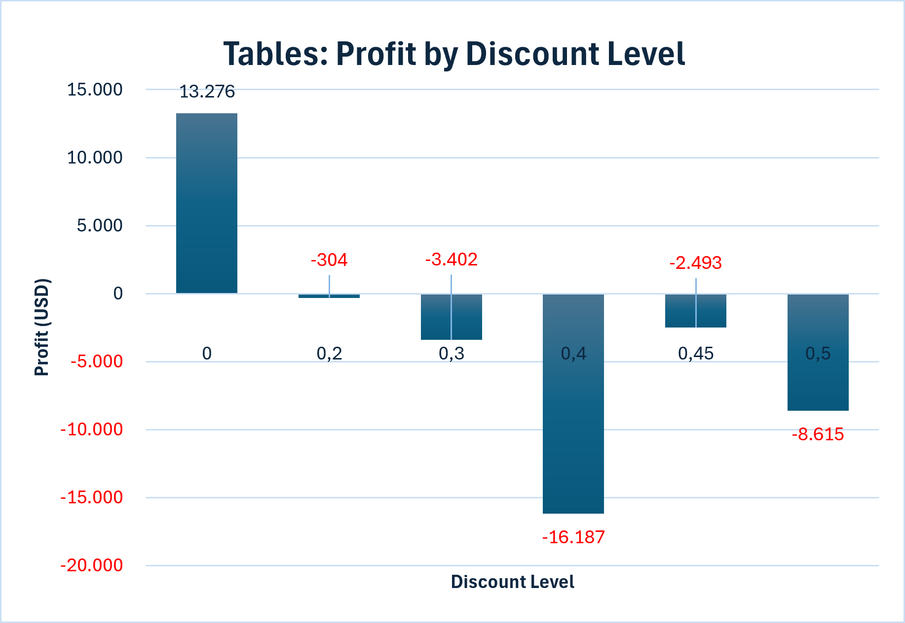

# Sales & Profitability Analysis

## Project Goal
This project analyses sales, costs and profitability data to identify
revenue drivers, high-margin products and potential profitability risks.

## Business Questions
- Which products and categories generate the highest revenue?
- Which products generate the highest profit margin?
- How do revenue and profit develop over time?
- Which areas require management attention?

## Planned Tools
- SQL
- Python
- Power BI
- Excel

## Project Status
Work in progress. The project will include data preparation,
exploratory analysis, KPI reporting and a Power BI dashboard.

## Author
Brian Jacob Nergiz

## Key Finding

Tables were profitable without discounts, but became unprofitable from a
20% discount onward. The largest losses occurred at discount levels between
40% and 50%.

